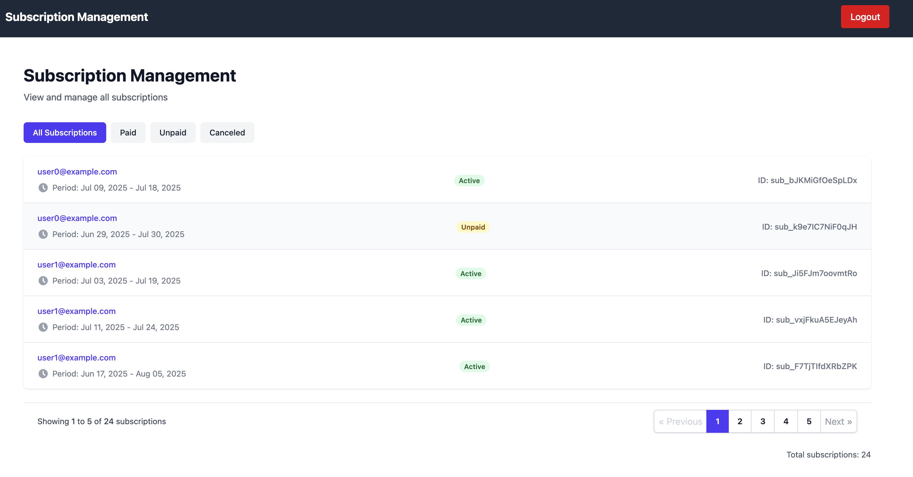
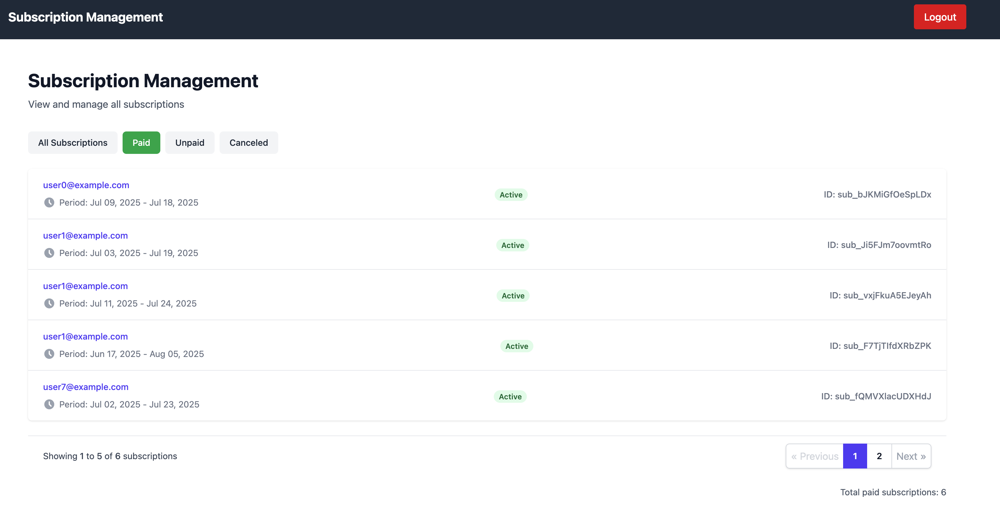
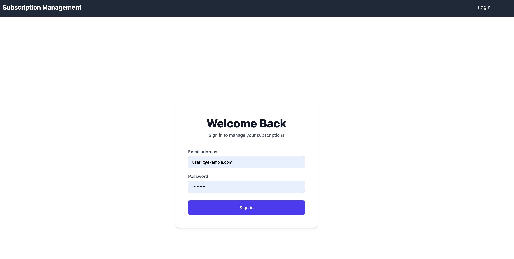

# Subscription Management

A simple subscription management application.

## System dependencies

- Ruby 3.4.4
- Rails 8.0.2
- PostgreSQL

## Configuration

- Update `database.yml` with your PostgreSQL credentials.

## Database creation

```bash
rails db:create
```

## Database initialization

```bash
rails db:migrate
```

## How to run the test suite

```bash
rspec spec
```

## Screenshots

Here are some screenshots of the application:




